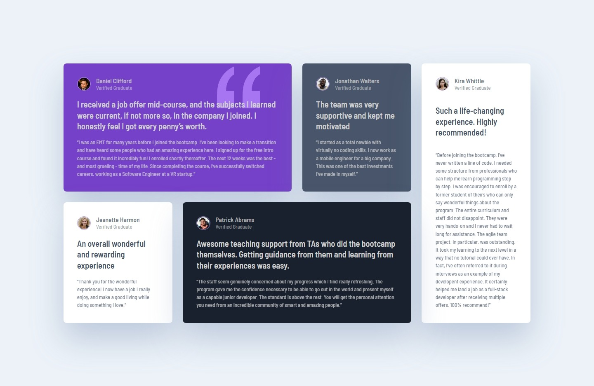

# Frontend Mentor - Testimonials grid section solution

This is a solution to the [Testimonials grid section challenge on Frontend Mentor](https://www.frontendmentor.io/challenges/testimonials-grid-section-Nnw6J7Un7). Frontend Mentor challenges help you improve your coding skills by building realistic projects. 

## Table of contents

- [Overview](#overview)
  - [The challenge](#the-challenge)
  - [Screenshot](#screenshot)
  - [Links](#links)
- [My process](#my-process)
  - [Built with](#built-with)
  - [What I learned](#what-i-learned)
  - [Continued development](#continued-development)
  - [Useful resources](#useful-resources)
- [Author](#author)

## Overview

### The challenge

Users should be able to:

- View the optimal layout for the site depending on their device's screen size

### Screenshot

### Links

- Solution URL: [https://github.com/agelitaeme/testimonials-grid-section.git](https://your-solution-url.com)
- Live Site URL: [Add live site URL here](https://your-live-site-url.com)

## My process

### Built with

- Semantic HTML5 markup
- CSS custom properties
- Flexbox
- CSS Grid

### What I learned

I learned how to use grid-template-areas which I find quite useful.

### Continued development

I would like to solve the different proposed challenges in a much more responsive way, if possible. 

### Useful resources

- [Free Code Camp Youtube channel](https://www.youtube.com/c/Freecodecamp)
- [Free Code Camp CSS Grid Course](https://www.youtube.com/watch?v=t6CBKf8K_Ac)

## Author

- Frontend Mentor - [@agelitaeme](https://www.frontendmentor.io/profile/agelitaeme)
- Twitter - [@Agelita_eMe](https://twitter.com/Agelita_eMe)

